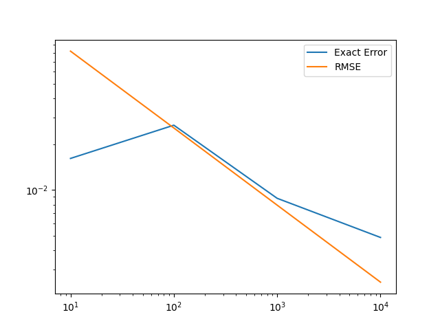
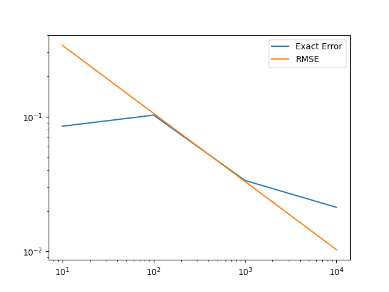

# Bonus Exercise 1. Team 32. Report. Monte Carlo sampling and variance reduction techniques.

# Team Members
Diana Deldar Abdolmaleki - 03732135
Maximilian Fehrentz - <Insert Matrikel>
Matteo Wohlrapp - 03727946

# 1. Introduction to Monte Carlo sampling estimator

## Assignment 1.1

### Task
Assume that a vector G represents a set of exam grades for a course. First, compute the mean and the variance of G using basic Python functionality.

Then, compute the same qunatities of interest using numpy’s functions. Do you get identical resutls? If not, why?

### Our Solution
grades [1.3 1.7 1.  2.  1.3 1.7 2.  2.3 2.  1.7 1.3 1.  2.  1.7 1.7 1.3 2. ]
mean_python       1.6470588235294117, var_python       0.14889705882352938
mean_numpy_ddof_0 1.6470588235294117, var_numpy_ddof_0 0.14013840830449825
mean_numpy_ddof_1 1.6470588235294117, var_numpy_ddof_1 0.14889705882352938

We can see that the mean values are the same in all three cases - our python calculation, using the formula from the lecture, and the two cases using numpy built-in function with different parameter values for ddof (degrees of freedom) being set to 0 or 1.

We can see that the values of the computed variance are not the same in all three cases. The values are the same for our python calculation and the numpy built-in function when the ddof parameter is set to 1, because this creates the same divisor (n-ddof)=(n-1) as we have in our python calculation. In case we use ddof=0, the divisor is (n-ddof)=(n-0)=n, which leads to a different variance value.

## Assignment 1.2

### Task
Now, we can apply the same idea to estimate mean and covariance of a multivariate random variable X.

Consider a bivariate normal distribution with the given mean µ= [−0.4,1.1]**T and covariance matrix V = [[2,0.4],[0.4,1]]. First, generate N = [10,100,1000,10000] samples from the given bivariate normal distribution.

Next, use Monte Carlo sampling over the N samples to approximate the mean values and covariance matrix.

Report the mean and covariance values for an increasing number of samples.

As you know the true values of the mean and covairiance, plot the aboslute
error of your estimator. It is enough if you only report results for one mean
value and for two covariance values: one diagonal, one off-diagonal.

Additionally, plot the RMSE (eq. (1)) for the mean estimator

Can we use the same formula for the covariance estimator? Why?

### Our Solution
N = 10: mean [-0.5811197   0.78748464], covariance [[1.6687410346187148, -0.1651161666269441], [-0.1651161666269441, 0.4708837699753663]]
N = 100: mean [-0.36547733  1.06675853], covariance [[1.7595838189988084, 0.2305061347967368], [0.2305061347967368, 0.6503427537275073]]
N = 1000: mean [-0.28950557  1.10056329], covariance [[2.0178629217158717, 0.32103036138338786], [0.32103036138338786, 0.9674796948982014]]
N = 10000: mean [-0.40091235  1.11160838], covariance [[1.987918433957291, 0.36409937120276903], [0.36409937120276903, 1.0091297909341337]]

N = 10: rmse [0.40850226861288236, 0.21699856450570504]
N = 100: rmse [0.1326493052751807, 0.0806438313653008]
N = 1000: rmse [0.044920629133126264, 0.03110433562862582]
N = 10000: rmse [0.014099356134083894, 0.010045545236243444]

TODO: Insert plots (see "report/12_abs_errors.png", "report/12_rmse_errors.png")
TODO: Answer "Can we use the same formula for the covariance estimator?".

# 2. Monte Carlo Integration

## Assignment 2.1



We can see that the RMSE decays linearly on a log-log plot, reflecting the theoretical convergence rate `O(1/√N)`. RMSE is relatively smooth because it's derived from the sample standard deviation — a second-moment statistic, which is less sensitive to individual sample fluctuations. It serves as a reliable estimate for how much we expect the MC result to deviate from the true integral value on average.

In contrast, the exact error plotted here represents the absolute difference between the Monte Carlo estimate and the true value of the integral for a single simulation:

```
Exact Error = |MC_Estimate - True_Integral|
```

This quantity fluctuates because it's tied to one specific set of random samples. Especially for small `N`, the error can vary significantly — sometimes underestimating and sometimes overestimating the true value — purely due to randomness. This is expected behavior and reflects the variance of the estimator.

While the RMSE quantifies the expected error magnitude (i.e., the average over many possible runs), the exact error is just one realization and can be above or below the RMSE.

Finally, it's worth noting that if a fixed random seed is used for each `N`, the samples for larger `N` are extensions of those from smaller `N` (e.g., `N=1000` includes the first 100 samples used in `N=100`). This can make the curve for RMSE appear smoother than it would if fully independent samples were used for each run. The same applies to the exact error — its path reflects one specific sampling trajectory.

## Assignment 2.2




We observe that the RMSE again decays linearly on the log-log plot, consistent with the expected convergence rate `O(1/√N)`. As in Assignment 2.1, the RMSE provides a smooth and reliable estimate of the expected error magnitude due to sampling variability.

The exact error fluctuates for small sample sizes, which is expected for a single Monte Carlo realization. These fluctuations diminish as `N` increases, and the estimator stabilizes around the true integral.

In this assignment, we compared two equivalent sampling approaches: sampling directly from `U(2, 4)` and transforming samples from `U(0, 1)` via `x = 2 + 2u`. Both methods yield nearly identical results for both RMSE and exact error, confirming that the transformation preserves the statistical properties of the estimator.

The RMSE has the same interpretation as in Assignment 2.1. The only difference is the domain length `(b - a) = 2`, which scales both the estimate and its variability. The RMSE formula naturally incorporates this through the multiplicative factor in the estimator and the corresponding scaling in the variance. Therefore, RMSE still quantifies the expected deviation of the Monte Carlo estimate from the true value due to sampling randomness.


# 3. Improving standard Monte Carlo sampling

# 4. Monte Carlo sampling for forward propagation UQ


